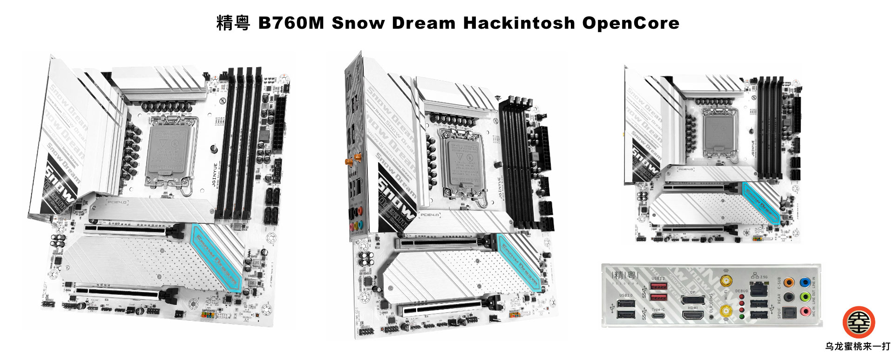

## JINGYUE B760M SNOW DREAM Hackintosh OpenCore EFI



### [简体中文](https://github.com/hackintosh-club/Jginyue-B760M-Snow-Dream-OpenCore)

### OpenCore

[OpenCore 0.9.9](https://github.com/acidanthera/OpenCorePkg)

### OS Version Tested

- macOS Monterey 12.x
- macOS Ventura    13.x
- macOS Sonoma   14.x

### Hardware

- Motherboard: B760
- Bios Version: JYRPL003 04/13/2023
- CPU: Intel 12th i9-12900 ES（QXQ3）
- RAM: Maxsun 16GBx2 DDR4 3200Mhz + Galaxy 16GBx2 DDR4 3200Mhz
- SSD: Samsung SSD 980 1TB MacOS
- SSD: YESTON 1TB Windows
- HDD: TOSHIBA DT01ACA100 1TB
- HDD: WDC WD30EZRX-19DCOB0 3TB
- iGPU: Intel UHD Graphic 770 (Only work in Windows)
- GPU: ASUS Radeon RX 5700XT 8GB GDDR6
- Audio: Realtek ALC897
- Ethernet Card: Realtek RTL8125 Gaming 2.5GbE
- WIFI: Intel AX200
- COOLING: Thermalright PA-120 WHITE
- CASE: aigo XingCan Lan White
- PSU:  aigo ES 750W GOLD

### Notes

 - Use [OpenCore Configurator](https://mackie100projects.altervista.org/opencore-configurator/) or [OCAuxiliaryTools](https://github.com/ic005k/OCAuxiliaryTools) build your SMBIOS
 - If you want to use a CPU without  Efficient-Core, you must uncheck the option in the config.plist file Kernel--ProvideCurrentCpuinfo
 - Intel WiFi driver [AirportItlwm.kext](https://github.com/OpenIntelWireless/itlwm/releases) in this EFI is only applicable to MacOS 14.3.1 Sonoma. Please download and replace this driver yourself when installing other MacOS versions
 - Intel Not Supported  Airdrop

### Bios Setup

```
Advanced
  |-- CPU Configuration
     |-- CPU Lock Configuration
	      |-- CFG Lock ：Disabled
	      
	Re-Size BAR Support：Disabled
           
  |-- CSM Configuration
     |-- CSM Support ：Disabled

BOOT
   |-- Secure Boot
      |-- Secure Boot ：Disabled 
```

### Contact Us

QQ Group: 23304408


### Tools

- [Hackintool](https://github.com/headkaze/Hackintool) 
- [OCAuxiliaryTools](https://github.com/ic005k/OCAuxiliaryTools) AKA `OCAT`.
- [OpenCore Configurator](https://mackie100projects.altervista.org/opencore-configurator/) AKA `OCC`.
- [gibMacOS](https://github.com/corpnewt/gibMacOS) Build your own MacOS image.
- [ProperTree](https://github.com/corpnewt/ProperTree) Plist editor.
